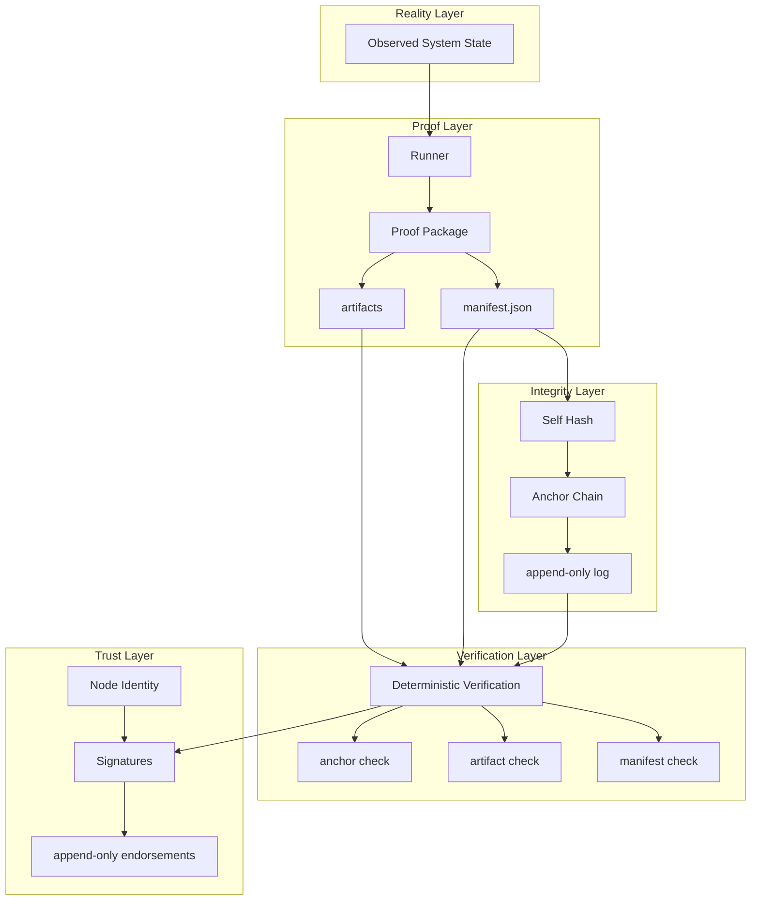

# Origin Audit Standard (OAS)
Draft Specification v0.1

---

# 1. Introduction

Origin Audit Standard (OAS) defines a deterministic framework for producing,
anchoring, verifying, and optionally endorsing audit evidence packages.

The system separates three logical layers:

Proof  
Verification  
Trust  

Trust is extended through signatures rather than consensus protocols.

---

# 2. Design Goals

OAS is designed to provide:

Deterministic verification  
Append-only audit anchoring  
Independent verification  
Optional trust endorsement  

The system avoids complex consensus systems and focuses on reproducible proof.

---

# 3. Core Model

The OAS model separates three layers.

## Proof Layer

A deterministic proof package describing an audit result.

## Verification Layer

An algorithm capable of recomputing and verifying the proof package.

## Trust Layer

Optional node signatures endorsing the proof.

Trust signatures do not modify the proof hash.

---

# 4. Proof Package

An OAS report generates a proof package containing:

manifest.json
artifacts/*
The manifest contains metadata and proof hash anchors.

Example fields:

report_id
generated_at
target.domain
artifacts
anchor
---

# 5. Anchor Chain

OAS maintains an append-only hash chain.

Each entry contains:

sequence
timestamp
hash
prev_hash
domain
Example format:

41 2026-03-02T11:46:05Z HASH PREV_HASH evanbei.com
This structure guarantees chronological integrity.

---

# 6. Manifest Hash Rule

The manifest hash is computed deterministically.

Steps:

1 Remove `anchor.current_hash`  
2 Normalize `signatures` to an empty list  
3 Canonical JSON serialization  
4 Compute SHA256

This ensures signatures do not affect proof hashes.

---

# 7. Verification

Verification recomputes proof integrity.

Verifier checks:

manifest self-hash  
artifact hashes  
anchor presence  
anchor chain continuity  

Reference implementation:

oas/verify/verify_oas.py
---

# 8. Signature Layer

Nodes may optionally endorse a proof.

Signatures are appended to the manifest:

signatures[]
Example:

{
node_id
key_id
algorithm
signed_at
signature
}
Signatures do not modify proof hashes.

---

# 9. Node Identity

Nodes publish identity using:

node.json
Example fields:

node_id
public_key
network metadata
This allows signature verification.

---

# 10. Trust Model

Trust grows through independent node signatures.

Nodes may:

sign  
ignore  
independently verify  

No central consensus is required.

---

# 11. Reference Implementation

Reference implementation repository:

aiorigins-audit
Components:

runner
anchor chain
verifier
signature tool
---

# 12. Security Considerations

OAS relies on:

deterministic verification  
append-only anchor logs  
public signature verification  

Nodes must protect private signing keys.

---

# 13. Future Extensions

Possible extensions include:

multiple signature nodes  
public anchor mirrors  
witness verification nodes  

These extensions do not modify the core proof algorithm.

---

# 14. Status

This document defines **Origin Audit Standard v0.1 Draft**.

The specification reflects the current reference implementation.

## Protocol Layer Structure

OAS separates five layers:

1. Reality Layer  
   The observed state of a domain, service, or network endpoint.

2. Proof Layer  
   A runner records the observation and produces a proof package.

3. Integrity Layer  
   The proof is locked by self-hash and appended to an anchor chain.

4. Verification Layer  
   Anyone can recompute proof validity using a deterministic algorithm.

5. Trust Layer  
   Independent nodes may append signatures without modifying the original proof.
