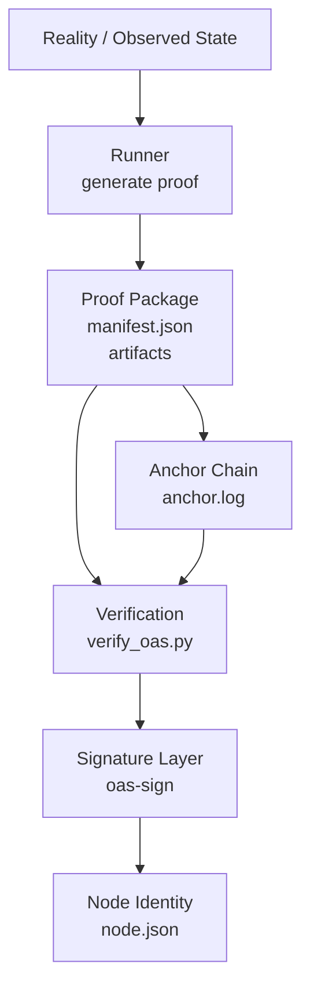

# OAS Architecture Overview

This repository contains the reference implementation of the **Origin Audit Standard (OAS)**.

---

## System Overview

---

## Runtime Architecture

Actual system currently running.

See:

docs/architecture-runtime.md

---

## Growth Architecture

Future natural expansion path of the trust layer.

See:

docs/architecture-growth.md

---

## Core Principle

The system separates three layers:

Proof  
Verification  
Trust  

Trust grows through **signatures**, not through **consensus complexity**.