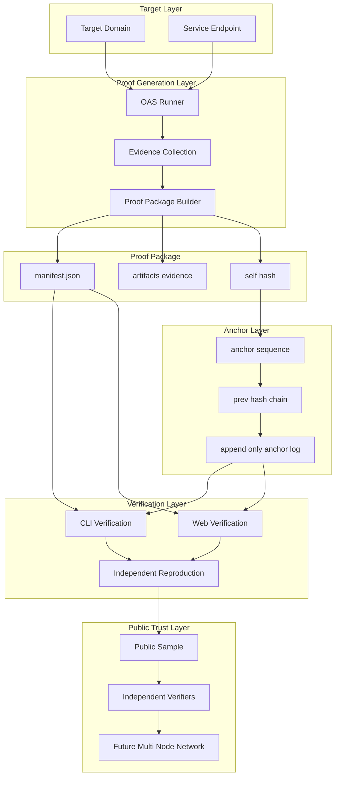

OAS Final Architecture

```mermaid
flowchart TB

%% LAYER 1
subgraph L1["Target Layer"]
A1[Target Domain]
A2[Service Endpoint]
end

%% LAYER 2
subgraph L2["Proof Generation Layer"]
B1[OAS Runner]
B2[Evidence Collection]
B3[Proof Package Builder]
end

%% LAYER 3
subgraph L3["Proof Package"]
C1[manifest.json]
C2[artifacts evidence]
C3[self hash]
end

%% LAYER 4
subgraph L4["Anchor Layer"]
D1[anchor sequence]
D2[prev hash chain]
D3[append only anchor log]
end

%% LAYER 5
subgraph L5["Verification Layer"]
E1[CLI Verification]
E2[Web Verification]
E3[Independent Reproduction]
end

%% LAYER 6
subgraph L6["Public Trust Layer"]
F1[Public Sample]
F2[Independent Verifiers]
F3[Future Multi Node Network]
end

A1 --> B1
A2 --> B1

B1 --> B2
B2 --> B3

B3 --> C1
B3 --> C2
B3 --> C3

C3 --> D1
D1 --> D2
D2 --> D3

C1 --> E1
C1 --> E2
D3 --> E1
D3 --> E2

E1 --> E3
E2 --> E3

E3 --> F1
F1 --> F2
F2 --> F3
```

Observation
→ Proof Package
→ Anchor Chain
→ Independent Verification
→ Public Trust

